# Product Overview

NCA8T245 is an 8-bit buffer/driver with two separate power supply. The two power supply voltages range from 1.65V to 5.5V. The A port tracks  $V_{CCA}$  and B port tracks  $V_{CCB}$ , so it supports low-voltage bidirectional shift between any of the 1.8V, 2.5V, 3.3V and 5.5V.

NCA8T245 is mainly used for asynchronous communication between two data buses. The device provides a direction-control (DIR) input for transmitting data bidirectionally. When DIR is logic high, it transmits data from A to B, and from B to A when DIR is logic low. The output-enable /OE tracks  $V_{CCA}$  and is low active, When /OE is high, the outputs are in high-impedance state. During power up and power down, /OE should be tied to VCC through a pull-up resistor to ensure the outputs high impedance state.

Each channel of NCA8T245 supports maximum 32 mA current drive when the power supply of output side ranges from 4.5V to 5.5V. All unused inputs must be held at  $V_{CC}$  or GND to prevent excess supply current.

# Key Features

- Qualified for Automotive applications: NCA8T245-Q1TSXR  
Control inputs are referenced to  $V_{\mathrm{CCA}}$  
- Power supply voltage: 1.65V to 5.5V  
- ESD Protection Exceeds JESD 22
— 4000V Human-Body Model (A114-A)
— 2000V Charged-Device Model (C101)  
Operation temperature:  $-40^{\circ}\mathrm{C} \sim 125^{\circ}\mathrm{C}$  
RoHS-compliant package: TSSOP24

# Applications

Motor driver  
- Traction inverter  
Industrial automation  
- Telecom

# Device Information

<table><tr><td>Part Number</td><td>Package</td><td>Body Size</td></tr><tr><td>NCA8T245-DTSXR</td><td>TSSOP24</td><td>7.80mm × 4.40mm</td></tr><tr><td>NCA8T245-Q1TSXR</td><td>TSSOP24</td><td>7.80mm × 4.40mm</td></tr></table>

# Functional Block Diagrams

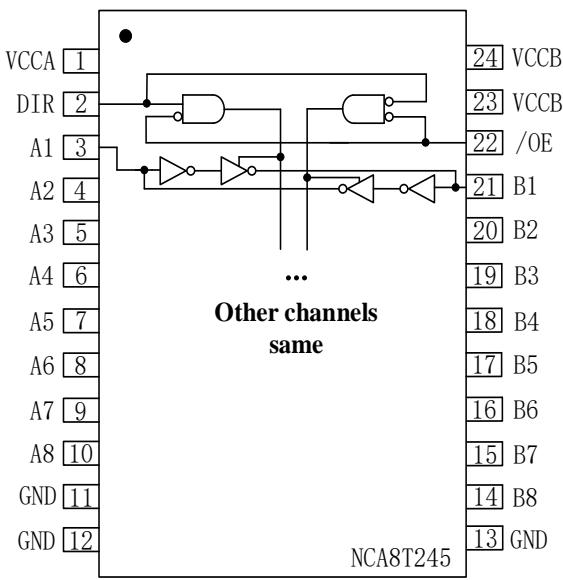  
Figure 1. NCA8T245 Block Diagram

# INDEX

1. PIN CONFIGURATION AND FUNCTIONS 3  
2.ABSOLUTE MAXIMUM RATINGS 4  
3. RECOMMENDED OPERATING CONDITIONS 5  
4. THERMAL INFORMATION 5  
5. SPECIFICATIONS 6

5.1. ELECTRICAL CHARACTERISTICS 6  
5.2. DYNAMIC CHARACTERISTICS -  $V_{CCA} = 1.8V \pm 0.15V$  
5.3. DYNAMIC CHARACTERISTICS -  $V_{CCA} = 2.5V \pm 0.2V$  
5.4. DYNAMIC CHARACTERISTICS -  $V_{CCA} = 3.3V \pm 0.3V$  8  
5.5. DYNAMIC CHARACTERISTICS -  $V_{CCA} = 5V \pm 0.5V$  
5.6. PARAMETER MEASUREMENT INFORMATION 9

6. FUNCTION DESCRIPTION 10  
6.1. OVERVIEW 10  
7.APPLICATION NOTE 11  
7.1. APPLICATION INFORMATION 11  
7.2. TYPICAL APPLICATION CIRCUIT 11

8. PACKAGE INFORMATION 11  
9. ORDERING INFORMATION 12  
10. TAPE AND REEL INFORMATION 12  
11. REVISION HISTORY 14

# 1. Pin Configuration and Functions

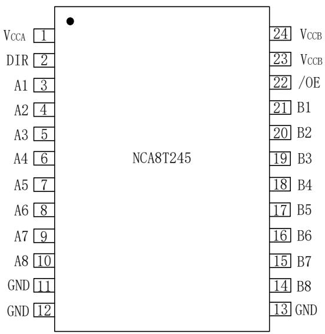  
Figure 1.1 NCA8T245 Package

Table 1.1 NCA8T245 Pin Configuration and Description  

<table><tr><td>NCA8T245 PIN
NO.</td><td>SYMBOL</td><td>FUNCTION</td></tr><tr><td>1</td><td>VCCA</td><td>Power supply for A side</td></tr><tr><td>2</td><td>DIR</td><td>Direction control, referenced to VCCA. DIR is logic high, direction is from A to B while DIR is logic low, transmission is from B to A.</td></tr><tr><td>3</td><td>A1</td><td>Input/Output, referenced to VCCA</td></tr><tr><td>4</td><td>A2</td><td>Input/Output, referenced to VCCA</td></tr><tr><td>5</td><td>A3</td><td>Input/Output, referenced to VCCA</td></tr><tr><td>6</td><td>A4</td><td>Input/Output, referenced to VCCA</td></tr><tr><td>7</td><td>A5</td><td>Input/Output, referenced to VCCA</td></tr><tr><td>8</td><td>A6</td><td>Input/Output, referenced to VCCA</td></tr><tr><td>9</td><td>A7</td><td>Input/Output, referenced to VCCA</td></tr><tr><td>10</td><td>A8</td><td>Input/Output, referenced to VCCA</td></tr><tr><td>11</td><td>GND</td><td>Ground</td></tr><tr><td>12</td><td>GND</td><td>Ground</td></tr><tr><td>13</td><td>GND</td><td>Ground</td></tr><tr><td>14</td><td>B8</td><td>Input/Output, referenced to VCCB</td></tr><tr><td>15</td><td>B7</td><td>Input/Output, referenced to VCCB</td></tr><tr><td>16</td><td>B6</td><td>Input/Output, referenced to VCCB</td></tr><tr><td>17</td><td>B5</td><td>Input/Output, referenced to VCCB</td></tr><tr><td>18</td><td>B4</td><td>Input/Output, referenced to VCCB</td></tr><tr><td>19</td><td>B3</td><td>Input/Output, referenced to VCCB</td></tr><tr><td>20</td><td>B2</td><td>Input/Output, referenced to VCCB</td></tr><tr><td>21</td><td>B1</td><td>Input/Output, referenced to VCCB</td></tr><tr><td>22</td><td>/OE</td><td>Active low output enable, referenced to VCCA</td></tr><tr><td>23</td><td>VCCB</td><td>Power supply for B side</td></tr><tr><td>24</td><td>VCCB</td><td>Power supply for B side</td></tr></table>

2. Absolute Maximum Ratings  

<table><tr><td>Parameters</td><td>Symbol</td><td>Min</td><td>Typ</td><td>Max</td><td>Unit</td><td>Comments</td></tr><tr><td>Power Supply Voltage</td><td>VCCA, VCCB</td><td>-0.5</td><td></td><td>7</td><td>V</td><td></td></tr><tr><td>Input Voltage</td><td>VI</td><td>-0.5</td><td></td><td>7</td><td>V</td><td>A, B port, control inputs</td></tr><tr><td rowspan="2">Output Voltage</td><td rowspan="2">Vo</td><td>-0.5</td><td></td><td>7</td><td>V</td><td>Voltage range applied to any output in the high-impedance or power-off state</td></tr><tr><td>-0.5</td><td></td><td>VCCA/VCCB+0.5</td><td>V</td><td>Voltage range applied to any output in the high or low state</td></tr><tr><td>Input clamp current</td><td>IK</td><td></td><td></td><td>-50</td><td>mA</td><td>V1&lt;0</td></tr><tr><td>Output clamp current</td><td>IOK</td><td></td><td></td><td>-50</td><td>mA</td><td>V0&lt;0</td></tr><tr><td rowspan="2">Continuous output current</td><td rowspan="2">IO</td><td>-50</td><td></td><td>50</td><td>mA</td><td>V0=0 to VCC</td></tr><tr><td>-100</td><td></td><td>100</td><td>mA</td><td>VCCA, VCCB, GND</td></tr><tr><td>Absolute Maximum Junction Temperature</td><td>TJ</td><td></td><td></td><td>150</td><td>°C</td><td></td></tr><tr><td>Storage Temperature</td><td>Tstg</td><td>-65</td><td></td><td>150</td><td>°C</td><td></td></tr><tr><td rowspan="2">Electrostatic discharge</td><td>HBM</td><td>-4000</td><td></td><td>4000</td><td>V</td><td>Per ANSI/ESDA/JEDEC JS-001</td></tr><tr><td>CDM</td><td>-2000</td><td></td><td>2000</td><td>V</td><td>Per JEDEC specification JESD22-C101</td></tr></table>

3. Recommended Operating Conditions  

<table><tr><td>Parameters</td><td>Symbol</td><td>Min</td><td>Typ</td><td>Max</td><td>Unit</td><td>Comments</td></tr><tr><td>Power Supply Voltage</td><td>VCCA, VCCB</td><td>1.65</td><td></td><td>5.5</td><td>V</td><td></td></tr><tr><td rowspan="4">High-level input voltage</td><td rowspan="4">VIH</td><td>VCCl(1)* 0.65</td><td></td><td></td><td rowspan="4">V</td><td>VCCl:1.65V to 1.95V</td></tr><tr><td>1.7</td><td></td><td></td><td>VCCl:2.3V to 2.7V</td></tr><tr><td>2</td><td></td><td></td><td>VCCl:3V to 3.6V</td></tr><tr><td>VCCl*0.7</td><td></td><td></td><td>VCCl:4.5V to 5.5V</td></tr><tr><td rowspan="4">Low-level input voltage</td><td rowspan="4">VIL</td><td></td><td></td><td>VCCl*0.35</td><td rowspan="4">V</td><td>VCCl:1.65V to 1.95V</td></tr><tr><td></td><td></td><td>0.7</td><td>VCCl:2.3V to 2.7V</td></tr><tr><td></td><td></td><td>0.8</td><td>VCCl:3V to 3.6V</td></tr><tr><td></td><td></td><td>VCCl*0.3</td><td>VCCl:4.5V to 5.5V</td></tr><tr><td rowspan="2">Input/Output Voltage</td><td rowspan="2">VI/O</td><td>0</td><td></td><td>VccO</td><td>V</td><td>Active state</td></tr><tr><td>0</td><td></td><td>5.5</td><td>V</td><td>3-state</td></tr><tr><td rowspan="4">High-level output current</td><td rowspan="4">IOH</td><td>-4</td><td></td><td></td><td rowspan="4">mA</td><td>VCCo(2):1.65V to 1.95V</td></tr><tr><td>-8</td><td></td><td></td><td>VccO:2.3V to 2.7V</td></tr><tr><td>-24</td><td></td><td></td><td>VccO:3V to 3.6V</td></tr><tr><td>-32</td><td></td><td></td><td>VccO:4.5V to 5.5V</td></tr><tr><td rowspan="4">Low-level output current</td><td rowspan="4">IOL</td><td></td><td></td><td>4</td><td rowspan="4">mA</td><td>VccO:1.65V to 1.95V</td></tr><tr><td></td><td></td><td>8</td><td>VccO:2.3V to 2.7V</td></tr><tr><td></td><td></td><td>24</td><td>VccO:3V to 3.6V</td></tr><tr><td></td><td></td><td>32</td><td>VccO:4.5V to 5.5V</td></tr><tr><td rowspan="4">Input transition rise or fall rate</td><td rowspan="4">Δt/Δv</td><td></td><td></td><td>20</td><td rowspan="4">ns/V</td><td>Vccl:1.65V to 1.95V</td></tr><tr><td></td><td></td><td>20</td><td>Vccl:2.3V to 2.7V</td></tr><tr><td></td><td></td><td>10</td><td>Vccl:3V to 3.6V</td></tr><tr><td></td><td></td><td>5</td><td>Vccl:4.5V to 5.5V</td></tr><tr><td>Operating free-air temperature</td><td>TA</td><td>-40</td><td></td><td>125</td><td>°C</td><td></td></tr></table>

(1)  $V_{\mathrm{CCl}}$  is the power supply of data input port.  
(2)  $V_{\mathrm{cc0}}$  is the power supply of data output port.

4. Thermal Information  

<table><tr><td>Parameters</td><td>Symbol</td><td>TSSOP24</td><td>Unit</td></tr><tr><td>Junction-to-ambient thermal resistance</td><td>θJA</td><td>90.6</td><td>°C/W</td></tr><tr><td>Junction-to-case(top) thermal resistance</td><td>θJC (top)</td><td>27.6</td><td>°C/W</td></tr><tr><td>Junction-to-board thermal resistance</td><td>θJB</td><td>45.3</td><td>°C/W</td></tr><tr><td>Junction-to-top characterization parameter</td><td>ΨJT</td><td>1.3</td><td>°C/W</td></tr><tr><td>Junction-to-board characterization parameter</td><td>ΨJB</td><td>44.8</td><td>°C/W</td></tr></table>

# 5. Specifications

# 5.1. Electrical Characteristics

(Ta=-40°C to 125°C. Unless otherwise noted, Typical values are at Ta = 25°C)  

<table><tr><td>Parameters</td><td>Symbol</td><td>Min</td><td>Typ</td><td>Max</td><td>Unit</td><td>Comments</td></tr><tr><td rowspan="5">High-level output voltage</td><td rowspan="5">VOH</td><td>VCO(1)-0.1</td><td></td><td></td><td rowspan="5">V</td><td>IOH=-100uA, VCCA=VCCB=1.65 to 4.5V</td></tr><tr><td>1.2</td><td></td><td></td><td>IOH=-4mA, VCCA=VCCB=1.65V</td></tr><tr><td>1.9</td><td></td><td></td><td>IOH=-8mA, VCCA=VCCB=2.3V</td></tr><tr><td>2.4</td><td></td><td></td><td>IOH=-24mA, VCCA=VCCB=3V</td></tr><tr><td>3.8</td><td></td><td></td><td>IOH=-32mA, VCCA=VCCB=4.5V</td></tr><tr><td rowspan="5">Low-level output voltage</td><td rowspan="5">VOL</td><td></td><td></td><td>0.1</td><td rowspan="5">V</td><td>IOL=100uA, VCCA=VCCB=1.65 to 4.5V</td></tr><tr><td></td><td></td><td>0.45</td><td>IOL=4mA, VCCA=VCCB=1.65V</td></tr><tr><td></td><td></td><td>0.3</td><td>IOL=8mA, VCCA=VCCB=2.3V</td></tr><tr><td></td><td></td><td>0.55</td><td>IOL=24mA, VCCA=VCCB=3V</td></tr><tr><td></td><td></td><td>0.55</td><td>IOL=32mA, VCCA=VCCB=4.5V</td></tr><tr><td>Input current</td><td>Ii</td><td>-2</td><td></td><td>2</td><td>uA</td><td>DIR pin
Vi=VCCA or GND, VCCA=VCCB=1.65 to 5.5V</td></tr><tr><td rowspan="2">Shut down leakage current</td><td rowspan="2">Ioff</td><td>-2</td><td></td><td>2</td><td rowspan="2">uA</td><td>Vi or Vo=0 to 5.5V, VCCA=0V, VCCB=0 to 5.5V</td></tr><tr><td>-2</td><td></td><td>2</td><td>Vi or Vo=0 to 5.5V, VCCA=0 to 5.5V, VCCB=0V</td></tr><tr><td>Three-state output current</td><td>IOZ</td><td>-2</td><td></td><td>2</td><td>uA</td><td>Vo = VCCO or GND, /OE = VIH, VCCA=VCCB=1.65 to 5.5V</td></tr><tr><td rowspan="4">Supply current</td><td rowspan="3">ICCA</td><td></td><td></td><td>15</td><td rowspan="3">uA</td><td>VI=VCCI(2) or GND, Io=0, VCCA=VCCB=1.65 to 5.5V</td></tr><tr><td></td><td></td><td>15</td><td>VI=VCCI or GND, Io=0, VCCA=5V, VCCB=0V</td></tr><tr><td></td><td></td><td>-2</td><td>VI=VCCI or GND, Io=0, VCCA=0V, VCCB=5V</td></tr><tr><td>ICCB</td><td></td><td></td><td>15</td><td>uA</td><td>VI=VCCI or GND, Io=0, VCCA=VCCB=1.65 to 5.5V</td></tr><tr><td rowspan="3"></td><td rowspan="2"></td><td></td><td></td><td>-2</td><td rowspan="2"></td><td>VI=VCCI or GND, Io=0
VCCA=5V, VCCB=0V</td></tr><tr><td></td><td></td><td>15</td><td colspan="1">VI=VCCI or GND, Io=0
VCCA=0V, VCCB=5V</td></tr><tr><td>ICCA+ICCB</td><td></td><td></td><td>25</td><td>uA</td><td colspan="1">VI=VCCI or GND, Io=0
VCCA=VCCB=1.65 to 5.5V</td></tr><tr><td rowspan="3">Increasing supply current(3)</td><td rowspan="2">ΔICCBA</td><td></td><td></td><td>50</td><td rowspan="2">uA</td><td>One A port at VCCA-0.6V,
VCCA=VCCB=3 to 5.5V
DIR at VCCA, B port = open</td></tr><tr><td></td><td></td><td>50</td><td colspan="1">DIR at VCCA-0.6V, B port = open,
VCCA=VCCB=3 to 5.5V
A port at VCCA or GND</td></tr><tr><td>ΔICCBA</td><td></td><td></td><td>50</td><td>uA</td><td colspan="1">One B port at VCCB-0.6V,
VCCA=VCCB=3 to 5.5V
DIR at GND, A port = open</td></tr><tr><td>Input capacitance</td><td>Ci</td><td></td><td>4</td><td></td><td>pF</td><td>Control inputs</td></tr><tr><td>Output capacitance</td><td>Co</td><td></td><td>8.5</td><td></td><td>pF</td><td></td></tr></table>

(1)  $V_{\mathrm{cc0}}$  is the power supply of output.  
(2)  $V_{\mathrm{CCl}}$  is the power supply of input.  
(3) The increasing of supply current for each input that is at one of the specified voltage levels, rather than  $0\mathrm{V}$  or  $V_{cc}$ .

# 5.2. Dynamic Characteristics —  $V_{CCA} = 1.8V \pm 0.15V$

$\left(\mathrm{V}_{\mathrm{CCA}} = 1.8 \mathrm{~V} \pm 0.15 \mathrm{~V}, \mathrm{T} a = -40^{\circ} \mathrm{C}\right.$  to  $125^{\circ} \mathrm{C}$ . Unless otherwise noted, Typical values are at Ta = 25°C (See figure 5.1)

<table><tr><td rowspan="2">Parameters</td><td rowspan="2">Symbol</td><td colspan="2">VCCB=1.8V±0.15V</td><td colspan="2">VCCB=2.5V±0.2V</td><td colspan="2">VCCB=3.3V±0.3V</td><td colspan="2">VCCB=5V±0.5V</td><td rowspan="2">Unit</td><td rowspan="2">Comments</td></tr><tr><td>MIN</td><td>MAX</td><td>MIN</td><td>MAX</td><td>MIN</td><td>MAX</td><td>MIN</td><td>MAX</td></tr><tr><td rowspan="4">Propagation Delay</td><td>tPLH</td><td rowspan="2">1</td><td rowspan="2">15</td><td rowspan="2">1</td><td rowspan="2">15</td><td rowspan="2">1</td><td rowspan="2">15</td><td rowspan="2">1</td><td rowspan="2">15</td><td rowspan="2">ns</td><td rowspan="2">A to B</td></tr><tr><td>tPHL</td></tr><tr><td>tPLH</td><td rowspan="2">1</td><td rowspan="2">15</td><td rowspan="2">1</td><td rowspan="2">15</td><td rowspan="2">1</td><td rowspan="2">15</td><td rowspan="2">1</td><td rowspan="2">15</td><td rowspan="2">ns</td><td rowspan="2">B to A</td></tr><tr><td>tPHL</td></tr><tr><td>Enable to Data high Valid</td><td>tpZH</td><td rowspan="2">2</td><td rowspan="2">25</td><td rowspan="2">2</td><td rowspan="2">25</td><td rowspan="2">2</td><td rowspan="2">25</td><td rowspan="2">2</td><td rowspan="2">25</td><td rowspan="2">ns</td><td rowspan="2">/OE to A</td></tr><tr><td>Enable to Data Low Valid</td><td>tpZL</td></tr><tr><td>Enable to Data high Valid</td><td>tpZH</td><td rowspan="2"></td><td rowspan="2">25</td><td rowspan="2"></td><td rowspan="2">20</td><td rowspan="2"></td><td rowspan="2">25</td><td rowspan="2"></td><td rowspan="2">25</td><td rowspan="2">ns</td><td rowspan="2">/OE to B</td></tr><tr><td>Enable to Data Low Valid</td><td>tpZL</td></tr><tr><td>Disable high to tri-state</td><td>tpHZ</td><td></td><td>25</td><td></td><td>25</td><td></td><td>25</td><td></td><td>25</td><td>ns</td><td>/OE to A</td></tr></table>

<table><tr><td>Disable low to tri-state</td><td>\(t_{PLZ}\)</td><td></td><td></td><td></td><td></td><td></td><td></td><td></td><td></td><td></td></tr><tr><td>Disable high to tri-state</td><td>\(t_{PHZ}\)</td><td rowspan="2"></td><td rowspan="2">25</td><td rowspan="2"></td><td rowspan="2">25</td><td rowspan="2"></td><td rowspan="2">25</td><td rowspan="2"></td><td rowspan="2">25</td><td rowspan="2">ns /OE to B</td></tr><tr><td>Disable low to tri-state</td><td>\(t_{PLZ}\)</td></tr></table>

# 5.3. Dynamic Characteristics— $\mathbf{V}_{\mathrm{CCA}} = 2.5\mathrm{V} \pm 0.2\mathrm{V}$

$\left(\mathrm{V}_{\mathrm{CCA}} = 2.5 \mathrm{~V} \pm 0.2 \mathrm{~V}, \mathrm{Ta} = -40^{\circ} \mathrm{C}\right.$  to  $125^{\circ} \mathrm{C}$ . Unless otherwise noted, Typical values are at Ta = 25°C (See figure 5.1)

<table><tr><td rowspan="2">Parameters</td><td rowspan="2">Symbol</td><td colspan="2">VCCB=1.8V±0.15V</td><td colspan="2">VCCB=2.5V±0.2V</td><td colspan="2">VCCB=3.3V±0.3V</td><td colspan="2">VCCB=5V±0.5V</td><td rowspan="2">Unit</td><td rowspan="2">Comments</td></tr><tr><td>MIN</td><td>MAX</td><td>MIN</td><td>MAX</td><td>MIN</td><td>MAX</td><td>MIN</td><td>MAX</td></tr><tr><td rowspan="4">Propagation Delay</td><td>tPLH</td><td rowspan="2">1.5</td><td rowspan="2">15</td><td rowspan="2">1.5</td><td rowspan="2">15</td><td rowspan="2">1.5</td><td rowspan="2">15</td><td rowspan="2">1.5</td><td rowspan="2">15</td><td rowspan="2">ns</td><td rowspan="2">A to B</td></tr><tr><td>tPHL</td></tr><tr><td>tPLH</td><td rowspan="2">1.5</td><td rowspan="2">15</td><td rowspan="2">1.5</td><td rowspan="2">15</td><td rowspan="2">1.5</td><td rowspan="2">15</td><td rowspan="2">1.5</td><td rowspan="2">15</td><td rowspan="2">ns</td><td rowspan="2">B to A</td></tr><tr><td>tPHL</td></tr><tr><td>Enable to Data high Valid</td><td>tpZH</td><td rowspan="2">1</td><td rowspan="2">20</td><td rowspan="2">1</td><td rowspan="2">20</td><td rowspan="2">1</td><td rowspan="2">20</td><td rowspan="2">1</td><td rowspan="2">20</td><td rowspan="2">ns</td><td rowspan="2">/OE to A</td></tr><tr><td>Enable to Data Low Valid</td><td>tpZL</td></tr><tr><td>Enable to Data high Valid</td><td>tpZH</td><td rowspan="2">1</td><td rowspan="2">20</td><td rowspan="2">1</td><td rowspan="2">20</td><td rowspan="2">1</td><td rowspan="2">20</td><td rowspan="2">1</td><td rowspan="2">20</td><td rowspan="2">ns</td><td rowspan="2">/OE to B</td></tr><tr><td>Enable to Data Low Valid</td><td>tpZL</td></tr><tr><td>Disable high to tri-state</td><td>tpHZ</td><td rowspan="2"></td><td rowspan="2">20</td><td rowspan="2"></td><td rowspan="2">20</td><td rowspan="2"></td><td rowspan="2">20</td><td rowspan="2"></td><td rowspan="2">20</td><td rowspan="2">ns</td><td rowspan="2">/OE to A</td></tr><tr><td>Disable low to tri-state</td><td>tPLZ</td></tr><tr><td>Disable high to tri-state</td><td>tpHZ</td><td rowspan="2"></td><td rowspan="2">20</td><td rowspan="2"></td><td rowspan="2">20</td><td rowspan="2"></td><td rowspan="2">20</td><td rowspan="2"></td><td rowspan="2">20</td><td rowspan="2">ns</td><td rowspan="2">/OE to B</td></tr><tr><td>Disable low to tri-state</td><td>tPLZ</td></tr></table>

# 5.4. Dynamic Characteristics —  $\mathbf{V}_{\mathrm{CCA}} = 3.3\mathbf{V} \pm 0.3\mathbf{V}$

$(V_{CCA} = 3.3V \pm 0.3V, Ta = -40^{\circ}C$  to  $125^{\circ}C$ . Unless otherwise noted, Typical values are at  $T_a = 25^{\circ}C$  (See figure 5.1)

<table><tr><td rowspan="2">Parameters</td><td rowspan="2">Symbol</td><td colspan="2">VCCB=1.8V±0.15V</td><td colspan="2">VCCB=2.5V±0.2V</td><td colspan="2">VCCB=3.3V±0.3V</td><td colspan="2">VCCB=5V±0.5V</td><td rowspan="2">Unit</td><td rowspan="2">Comments</td></tr><tr><td>MIN</td><td>MAX</td><td>MIN</td><td>MAX</td><td>MIN</td><td>MAX</td><td>MIN</td><td>MAX</td></tr><tr><td rowspan="4">Propagation Delay</td><td>tPLH</td><td rowspan="2">1.5</td><td rowspan="2">15</td><td rowspan="2">1.5</td><td rowspan="2">15</td><td rowspan="2">1.5</td><td rowspan="2">15</td><td rowspan="2">1.5</td><td rowspan="2">15</td><td rowspan="2">ns</td><td rowspan="2">A to B</td></tr><tr><td>tPHL</td></tr><tr><td>tPLH</td><td rowspan="2">1.5</td><td rowspan="2">15</td><td rowspan="2">1.5</td><td rowspan="2">15</td><td rowspan="2">1.5</td><td rowspan="2">15</td><td rowspan="2">1.5</td><td rowspan="2">15</td><td rowspan="2">ns</td><td rowspan="2">B to A</td></tr><tr><td>tPHL</td></tr><tr><td>Enable to Data high Valid</td><td>tpZH</td><td>1.5</td><td>20</td><td>1.5</td><td>20</td><td>1.5</td><td>20</td><td>1.5</td><td>20</td><td>ns</td><td>/OE to A</td></tr></table>

<table><tr><td>Enable to Data Low Valid</td><td>\(t_{PZL}\)</td><td></td><td></td><td></td><td></td><td></td><td></td><td></td><td></td><td></td></tr><tr><td>Enable to Data high Valid</td><td>\(t_{PZH}\)</td><td rowspan="2">1.5</td><td rowspan="2">20</td><td rowspan="2">1.5</td><td rowspan="2">20</td><td rowspan="2">1.5</td><td rowspan="2">20</td><td rowspan="2">1.5</td><td rowspan="2">20</td><td rowspan="2">ns /OE to B</td></tr><tr><td>Enable to Data Low Valid</td><td>\(t_{PZL}\)</td></tr><tr><td>Disable high to tri-state</td><td>\(t_{PHZ}\)</td><td rowspan="2">1.5</td><td rowspan="2">20</td><td rowspan="2">1.5</td><td rowspan="2">20</td><td rowspan="2">1.5</td><td rowspan="2">20</td><td rowspan="2">1.5</td><td rowspan="2">20</td><td rowspan="2">ns /OE to A</td></tr><tr><td>Disable low to tri-state</td><td>\(t_{PLZ}\)</td></tr><tr><td>Disable high to tri-state</td><td>\(t_{PHZ}\)</td><td rowspan="2">1.5</td><td rowspan="2">20</td><td rowspan="2">1.5</td><td rowspan="2">20</td><td rowspan="2">1.5</td><td rowspan="2">20</td><td rowspan="2">1.5</td><td rowspan="2">20</td><td rowspan="2">ns /OE to B</td></tr><tr><td>Disable low to tri-state</td><td>\(t_{PLZ}\)</td></tr></table>

# 5.5. Dynamic Characteristics —  $V_{CCA} = 5V \pm 0.5V$

$(V_{CCA} = 5V \pm 0.5V, Ta = -40^{\circ}C$  to  $125^{\circ}C$ . Unless otherwise noted, Typical values are at  $T_a = 25^{\circ}C$ ) (See figure 5.1)

<table><tr><td rowspan="2">Parameters</td><td rowspan="2">Symbol</td><td colspan="2">VCCB=1.8V±0.15V</td><td colspan="2">VCCB=2.5V±0.2V</td><td colspan="2">VCCB=3.3V±0.3V</td><td colspan="2">VCCB=5V±0.5V</td><td rowspan="2">Unit</td><td rowspan="2">Comments</td></tr><tr><td>MIN</td><td>MAX</td><td>MIN</td><td>MAX</td><td>MIN</td><td>MAX</td><td>MIN</td><td>MAX</td></tr><tr><td rowspan="4">Propagation Delay</td><td>tPLH</td><td rowspan="2">1.5</td><td rowspan="2">25</td><td rowspan="2">1</td><td rowspan="2">20</td><td rowspan="2">1</td><td rowspan="2">10</td><td rowspan="2">1</td><td rowspan="2">10</td><td rowspan="2">ns</td><td rowspan="2">A to B</td></tr><tr><td>tPHL</td></tr><tr><td>tPLH</td><td rowspan="2">1.5</td><td rowspan="2">25</td><td rowspan="2">1</td><td rowspan="2">20</td><td rowspan="2">1</td><td rowspan="2">10</td><td rowspan="2">1</td><td rowspan="2">10</td><td rowspan="2">ns</td><td rowspan="2">B to A</td></tr><tr><td>tPHL</td></tr><tr><td>Enable to Data high Valid</td><td>tpZH</td><td rowspan="2">1</td><td rowspan="2">15</td><td rowspan="2">1</td><td rowspan="2">15</td><td rowspan="2">1</td><td rowspan="2">15</td><td rowspan="2">1</td><td rowspan="2">15</td><td rowspan="2">ns</td><td rowspan="2">/OE to A</td></tr><tr><td>Enable to Data Low Valid</td><td>tpZL</td></tr><tr><td>Enable to Data high Valid</td><td>tpZH</td><td rowspan="2">1</td><td rowspan="2">15</td><td rowspan="2">1</td><td rowspan="2">15</td><td rowspan="2">1</td><td rowspan="2">15</td><td rowspan="2">1</td><td rowspan="2">15</td><td rowspan="2">ns</td><td rowspan="2">/OE to B</td></tr><tr><td>Enable to Data Low Valid</td><td>tpZL</td></tr><tr><td>Disable high to tri-state</td><td>tpHZ</td><td rowspan="2">1.5</td><td rowspan="2">15</td><td rowspan="2">1.5</td><td rowspan="2">15</td><td rowspan="2">1.5</td><td rowspan="2">15</td><td rowspan="2">1.5</td><td rowspan="2">15</td><td rowspan="2">ns</td><td rowspan="2">/OE to A</td></tr><tr><td>Disable low to tri-state</td><td>tPLZ</td></tr><tr><td>Disable high to tri-state</td><td>tpHZ</td><td rowspan="2">1.5</td><td rowspan="2">15</td><td rowspan="2">1.5</td><td rowspan="2">15</td><td rowspan="2">1.5</td><td rowspan="2">15</td><td rowspan="2">1.5</td><td rowspan="2">15</td><td rowspan="2">ns</td><td rowspan="2">/OE to B</td></tr><tr><td>Disable low to tri-state</td><td>tPLZ</td></tr></table>

# 5.6. Parameter measurement information

Figure 5.1. Load Circuit and Voltage Waveforms  
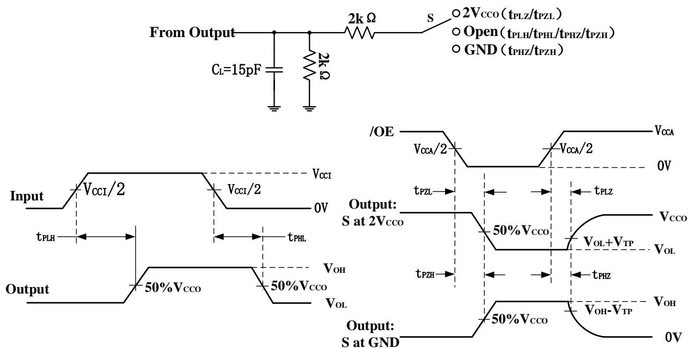  
Note: (1) All input pulses with the following characteristics: PRR ≤10MHz, ZO = 50Ω, dv/dt ≥1V/ns.  
（2）  $V_{\mathrm{CCO}} = 1.8\mathrm{V}\pm 0.15\mathrm{V}$  or  $V_{\mathrm{CCO}} = 2.5\mathrm{V}\pm 0.2\mathrm{V}$  .  $V_{\mathrm{TP}} = 0.15\mathrm{V};V_{\mathrm{CCO}} = 3.3\mathrm{V}\pm 0.3\mathrm{V}$  or  $V_{\mathrm{CCO}} = 5\mathrm{V}\pm 0.5\mathrm{V};V_{\mathrm{TP}} = 0.3\mathrm{V}.$

# 6. Function Description

# 6.1. Overview

NCA8T245 is an 8-bit buffer with dual supply and bidirectional transmission. A port and control signal pin are referenced to  $V_{CCA}$  while B port is referenced to  $V_{CCB}$ . The supply voltages  $V_{CCA}$  and  $V_{CCB}$  range from 1.65V to 5.5V, so NCA8T245 can shift different voltage level. It provides eight bidirectional channels with direction control DIR and output-enable(/OE). When DIR is logic high, the direction is from A to B and when DIR is logic low, the transmission is from B to A. /OE is low active, When /OE is high, the outputs are in the high-impedance state. During power up and power down, /OE should be tied to  $V_{CC}$  through a pull-up resistor to ensure the high impedance state. All unused inputs of NCA8T245 must be held at  $V_{CC}$  or GND to prevent excess  $I_{CC}$ .

Table 6.1 Function Table  

<table><tr><td>DIR</td><td>/OE</td><td>A</td><td>B</td><td>VCCA</td><td>VCCB</td><td>Comment</td></tr><tr><td>L(1)</td><td>L</td><td>L</td><td>L</td><td>Ready</td><td>Ready</td><td rowspan="2">Normal operation. Transmission from B to A</td></tr><tr><td>L</td><td>L</td><td>H</td><td>H</td><td>Ready</td><td>Ready</td></tr><tr><td>H</td><td>L</td><td>L</td><td>L</td><td>Ready</td><td>Ready</td><td rowspan="2">Normal operation. Transmission from A to B</td></tr><tr><td>H</td><td>L</td><td>H</td><td>H</td><td>Ready</td><td>Ready</td></tr><tr><td>L</td><td>H</td><td>Z</td><td>X</td><td>Ready</td><td>Ready</td><td rowspan="2">Output Disabled, the output is high impedance.</td></tr><tr><td>H</td><td>H</td><td>X</td><td>Z</td><td>Ready</td><td>Ready</td></tr><tr><td>X</td><td>X</td><td>Z</td><td>Z</td><td>Ready</td><td>Unready</td><td rowspan="3">The output follows the same status with the input after Vcc is powered on and output is enabled.</td></tr><tr><td>X</td><td>X</td><td>Z</td><td>Z</td><td>Unready</td><td>Ready</td></tr><tr><td>X</td><td>X</td><td>Z</td><td>Z</td><td>Unready</td><td>Unready</td></tr></table>

(1)  $\mathrm{L} =$  Logic low;  $\mathrm{H} =$  Logic high;  $\mathrm{X} =$  Logic low or logic high.

# 7. Application Note

# 7.1. Application Information

The NCA8T245 can be used in voltage level-shift applications for interface device or systems requiring different voltages. The maximum output current can be up to 32 mA at 5V supply.

# 7.2. Typical Application Circuit

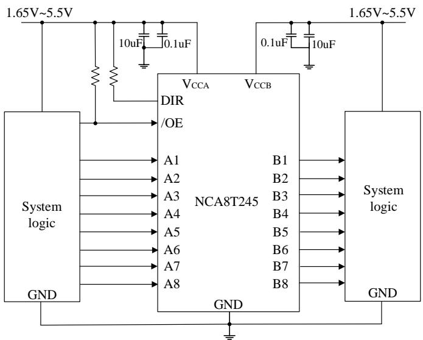  
Figure 7.1 Typical application circuit for NCA8T245

# 8. Package Information

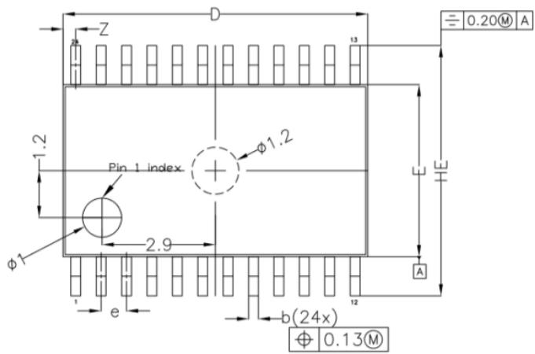  
TOP VIEW

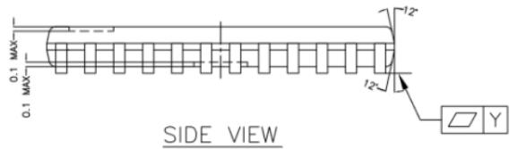  
Figure 8.1 TSSOP24 Package Shape and Dimension in millimeters

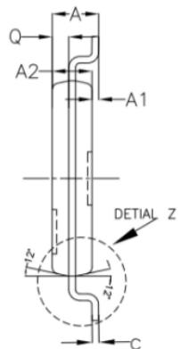

SIDE VIEW  
DETIAL Z  
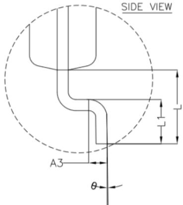  
NOTES  
1.0 COPLANARITY APPLIES TO LEADS, CORNER LEADS AND DIE ATTACH PAD.

# 9. Ordering Information

<table><tr><td>Part Number</td><td>PINS</td><td>Temperature</td><td>MSL</td><td>Package Type</td><td>Package Drawing</td><td>SPQ</td></tr><tr><td>NCA8T245-DTSXR</td><td>24</td><td>-40 to 125°C</td><td>1</td><td>TSSOP24</td><td>TSSOP24</td><td>2500</td></tr><tr><td>NCA8T245-Q1TSXR</td><td>24</td><td>-40 to 125°C</td><td>1</td><td>TSSOP24</td><td>TSSOP24</td><td>2500</td></tr><tr><td colspan="7">NOTE: All packages are RoHS-compliant with peak reflow temperatures of 260 °C according to the JEDEC industry standard classifications and peak solder temperatures.</td></tr></table>

# 10. Tape and Reel Information

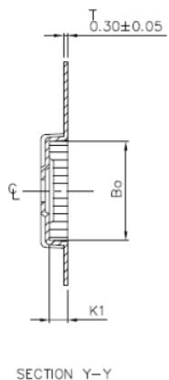

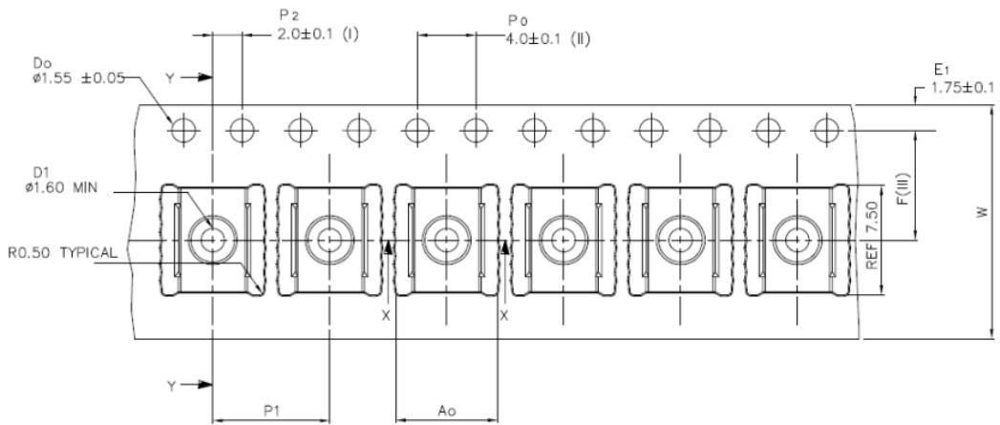

<table><tr><td>Ao</td><td>6.95 +/-0.1</td></tr><tr><td>Bo</td><td>7.10 +/-0.1</td></tr><tr><td>Ko</td><td>1.60 +/-0.1</td></tr><tr><td>K1</td><td>1.30 +/-0.1</td></tr><tr><td>F</td><td>7.50 +/-0.1</td></tr><tr><td>P1</td><td>8.00 +/-0.1</td></tr><tr><td>W</td><td>16.00 +/-0.3</td></tr></table>

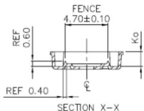

(1) Measured from centreline of sprocket hole to centreline of pocket.  
(I) Cumulative tolerance of 10 sprocket holes is  $\pm 0.20$  
(II) Measured from centreline of sprocket hole to centreline of pocket.  
(IV) Other material available.

ALL DIMENSIONS IN MILLIMETRES UNLESS OTHERWISE STATED.

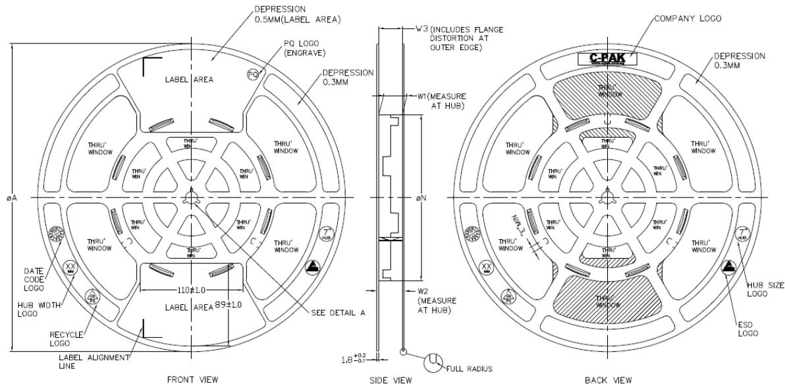

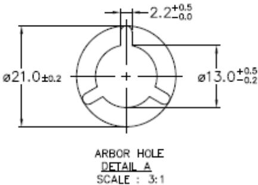

<table><tr><td colspan="7">PRODUCT SPECIFICATION</td></tr><tr><td>TAPEWIDTH</td><td>∅A±2.0</td><td>∅N±2.0</td><td>W1</td><td>W2(MAX)</td><td>W3</td><td>E(MIN)</td></tr><tr><td>08MM</td><td>330</td><td>178</td><td>8.4 ±2.0</td><td>14.4</td><td rowspan="2">SHALLACCUMMEDIATE</td><td>5.5</td></tr><tr><td>12MM</td><td>330</td><td>178</td><td>12.4 ±2.0</td><td>18.4</td><td>5.5</td></tr><tr><td>16MM</td><td>330</td><td>178</td><td>16.4 ±2.0</td><td>22.4</td><td rowspan="3">TAPE WIDTHWITHOUT</td><td>5.5</td></tr><tr><td>24MM</td><td>330</td><td>178</td><td>24.4 ±2.0</td><td>30.4</td><td>5.5</td></tr><tr><td>32MM</td><td>330</td><td>178</td><td>32.4 ±2.0</td><td>38.4</td><td>5.5</td></tr></table>

<table><tr><td colspan="4">SURFACE RESISTIVITY</td></tr><tr><td>LEGEND</td><td>SR RANGE</td><td>TYPE</td><td>COLOUR</td></tr><tr><td>A</td><td>BELOW 10°</td><td>ANTISTATIC</td><td>ALL TYPES</td></tr><tr><td>B</td><td>10° TO 10°</td><td>STATIC DISSIPATIVE</td><td>BLACK ONLY</td></tr><tr><td>C</td><td>10° &amp; BELOW 10°</td><td>CONDUCTIVE (GENERIC)</td><td>BLACK ONLY</td></tr><tr><td>E</td><td>10° TO 10°</td><td>ANTISTATIC (COATED)</td><td>ALL TYPES</td></tr></table>

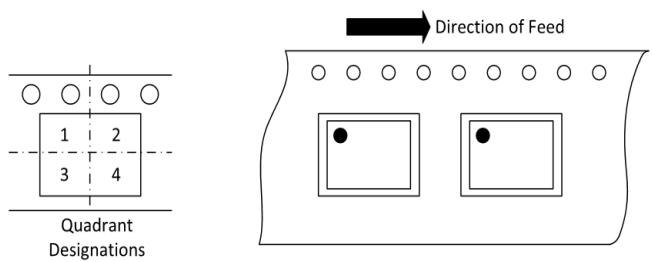  
Figure 10.1 Tape and Reel Information of TSSOP

# 11. Revision History

<table><tr><td>Revision</td><td>Description</td><td>Date</td></tr><tr><td>1.0</td><td>Initial Version.</td><td>2023/4/23</td></tr><tr><td></td><td></td><td></td></tr><tr><td></td><td></td><td></td></tr></table>

# IMPORTANT NOTICE

The information given in this document shall in no event be regarded as any warranty or authorization of, express or implied, including but not limited to accuracy, completeness, merchantability, fitness for a particular purpose or infringement of any third party's intellectual property rights.

You are solely responsible for your use of Novosense' products and applications, and for the safety thereof. You shall comply with all laws, regulations and requirements related to Novosense's products and applications, although information or support related to any application may still be provided by Novosense.

The resources are intended only for skilled developers designing with Novosense' products. Novosense reserves the rights to make corrections, modifications, enhancements, improvements or other changes to the products and services provided. Novosense authorizes you to use these resources exclusively for the development of relevant applications designed to integrate Novosense's products. Using these resources for any other purpose, or any unauthorized reproduction or display of these resources is strictly prohibited. Novosense shall not be liable for any claims, damages, costs, losses or liabilities arising out of the use of these resources.

For further information on applications, products and technologies, please contact Novosense (www.novosns.com).

Suzhou Novosense Microelectronics Co., Ltd